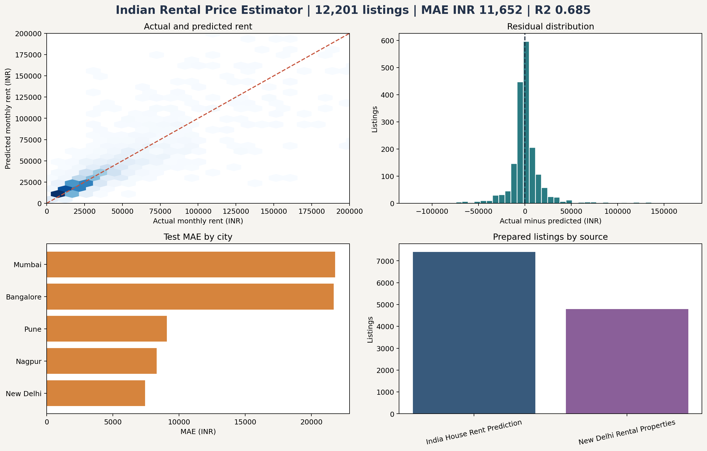
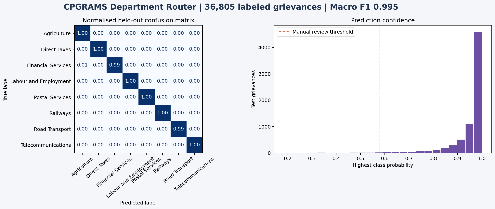

  

  I turn public Indian datasets and everyday service problems into reproducible analysis, evaluated models, and tested software.

  
  

## Portfolio snapshot

| Direction | Project | Evidence |
| :--- | :--- | ---: |
| Data analysis | India Public Health Facility Access Analytics | 200,438 source records and a Power BI ready model |
| Machine learning | Indian Metro Rental Price Estimator | 21,691 source listings across five cities |
| Language systems | India Public Grievance Department Router | 175,784 source grievances and eight departments |
| Software | BigTech Electronics Store | 28 products, seven categories, and ten automated tests |

## Project case studies

### 01 · India Public Health Facility Access Analytics

<table>
  <tr>
    <td width="58%"></td>
    <td width="42%" valign="top">
      
<strong>The issue</strong> A nationwide directory is large enough that duplicate facilities, invalid coordinates, and inconsistent labels can distort a facility access view.

      
<strong>The build</strong> A Python acquisition and quality pipeline, an analysis table, validation tests, DAX measures, a four page Power BI build guide, and a ten page report.

      
<strong>The outcome</strong> 200,438 source records became 193,783 clean records after 6,655 duplicates were removed. The final model covers 36 state and union territory labels, 688 state and district combinations, and 99.7% mapped records.

      
<a href="https://github.com/harikareddy9878-rgb/india-public-health-facility-access-analytics"><strong>Repository</strong></a> · <a href="https://github.com/harikareddy9878-rgb/india-public-health-facility-access-analytics/blob/main/reports/India_Public_Health_Facility_Access_Analytics_Report.pdf">PDF report</a>

    </td>
  </tr>
</table>

### 02 · Indian Metro Rental Price Estimator

<table>
  <tr>
    <td width="42%" valign="top">
      
<strong>The issue</strong> Rental listings are inconsistent across cities and a single estimate can hide wide local variation.

      
<strong>The build</strong> Two public rental sources, one cleaning pipeline, a leakage controlled train, calibration, and test split, a city median baseline, error analysis, and a calibrated interval.

      
<strong>The outcome</strong> 21,691 source listings produced 12,201 model rows across Bangalore, Mumbai, Nagpur, New Delhi, and Pune. On 1,831 unseen listings, MAE was ₹11,652 compared with a ₹22,122 city median baseline; the interval covered 89.7% of test rents.

      
<a href="https://github.com/harikareddy9878-rgb/india-metro-rental-price-estimator"><strong>Repository</strong></a> · <a href="https://github.com/harikareddy9878-rgb/india-metro-rental-price-estimator/blob/main/reports/Indian_Metro_Rental_Price_Estimator_Report.pdf">PDF report</a>

    </td>
    <td width="58%"></td>
  </tr>
</table>

### 03 · India Public Grievance Department Router

<table>
  <tr>
    <td width="58%"></td>
    <td width="42%" valign="top">
      
<strong>The issue</strong> A public complaint can be delayed when its text is sent to the wrong department, while an automatic router should not hide uncertainty.

      
<strong>The build</strong> A TF IDF and logistic regression pipeline with deduplication, a stratified holdout, department metrics, a confidence threshold, and a manual review route.

      
<strong>The outcome</strong> 175,784 source records produced 36,805 prepared examples across eight departments. The held out macro F1 was 0.995; 2.5% of test complaints were retained for review instead of receiving a low confidence automatic route.

      
<a href="https://github.com/harikareddy9878-rgb/india-public-grievance-department-router"><strong>Repository</strong></a> · <a href="https://github.com/harikareddy9878-rgb/india-public-grievance-department-router/blob/main/reports/India_Public_Grievance_Department_Router_Report.pdf">PDF report</a>

    </td>
  </tr>
</table>

### 04 · BigTech Electronics Store

<table>
  <tr>
    <td width="42%" valign="top">
      
<strong>The issue</strong> A useful retail demonstration needs consistent behaviour from search and stock through cart, payment outcome, delivery, orders, account, and support.

      
<strong>The build</strong> A responsive Indian electronics experience, an independently testable Java Spring Boot order service, and Ezzie for product, cart, delivery, return, and order questions.

      
<strong>The outcome</strong> Twenty eight products across seven categories support in stock, low stock, unavailable, successful payment, failed payment, and saved order scenarios. Seven frontend tests, three Java tests, and a production browser journey pass.

      
<a href="https://bigtech-electronics-store.vercel.app/"><strong>Live project</strong></a> · <a href="https://github.com/harikareddy9878-rgb/bigtech-electronics-store">Source</a> · <a href="https://github.com/harikareddy9878-rgb/bigtech-electronics-store/blob/main/reports/BigTech_Electronics_Store_Report.pdf">PDF report</a>

    </td>
    <td width="58%"></td>
  </tr>
</table>

## Tools I use

  

  
  
  
  
  
  

<table>
  <tr>
    <td><strong>Analyse</strong> Python · pandas · Power BI · data quality</td>
    <td><strong>Model</strong> scikit learn · regression · NLP · evaluation</td>
    <td><strong>Build</strong> Java · Spring Boot · JavaScript · REST</td>
    <td><strong>Verify</strong> pytest · JUnit · baselines · limitations</td>
  </tr>
</table>

## Project standard

I preserve source provenance, keep generated large files outside Git, separate preparation from evaluation, compare models with a baseline, test the important rules, include limitations beside results, and publish visual evidence with a detailed PDF report.

## Contact

  
  

