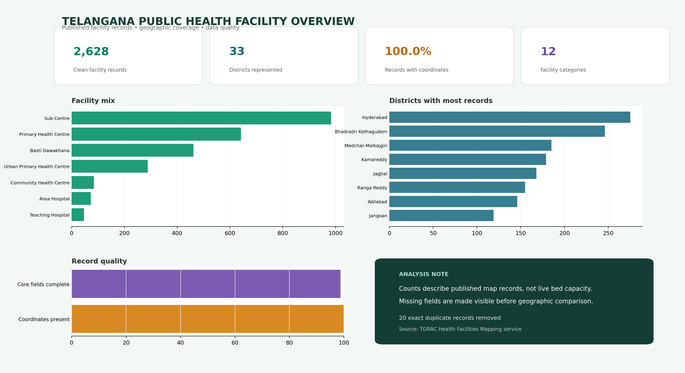
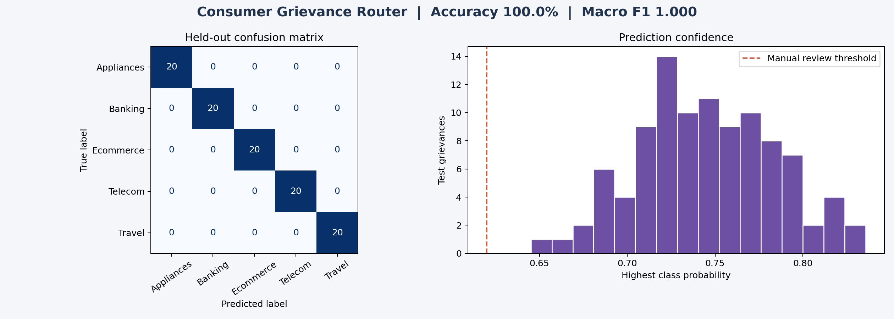
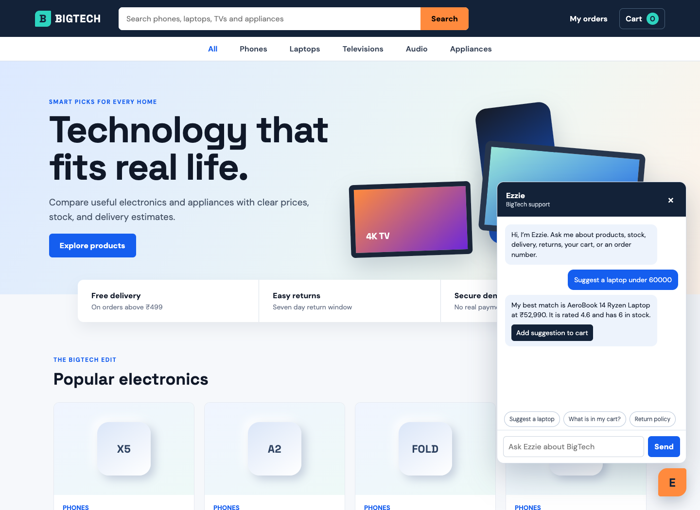

  

  I build compact, testable projects that turn public data and everyday Indian problems into useful analysis, models and software.

  
  

## Work in four directions

| Direction | Question I explored | Evidence |
| :--- | :--- | ---: |
| Public data | How can twelve separate Telangana health map layers become one reliable analytical view? | 2,628 clean facilities across 33 districts |
| Machine learning | Can a rent estimate reflect locality, size and access without pretending to be exact? | 212 held out Bengaluru examples |
| Language systems | How can a complaint reach a useful queue while uncertain cases remain visible? | 5 routing categories with an abstention rule |
| Software | Can a small electronics store connect stock, payment, delivery, orders and support? | 20 products across 5 categories |

## Project case studies

### 01 · Telangana Public Health Facility Analytics

<table>
  <tr>
    <td width="58%"></td>
    <td width="42%" valign="top">
      
<strong>The issue</strong> Facility records lived in separate government map layers with inconsistent nulls and duplicate entries.

      
<strong>The build</strong> A Python collection and cleaning pipeline, one analytical table, quality checks, reusable Power BI measures and a decision focused dashboard.

      
<strong>The outcome</strong> 2,648 source records became 2,628 clean facilities after 20 duplicates were removed. All retained facilities have mapped coordinates across 33 districts.

      
<a href="https://github.com/harikareddy9878-rgb/telangana-public-health-facility-analytics"><strong>Repository</strong></a> · <a href="https://github.com/harikareddy9878-rgb/telangana-public-health-facility-analytics/blob/main/reports/Telangana_Public_Health_Facility_Analytics_Report.pdf">PDF report</a>

    </td>
  </tr>
</table>

### 02 · Bengaluru Rent Estimator

<table>
  <tr>
    <td width="42%" valign="top">
      
<strong>The issue</strong> A city wide average hides how locality, size, furnishing, property age and metro access interact.

      
<strong>The build</strong> A repeatable scikit learn pipeline with a held out test set, error analysis and a prediction interval instead of false precision.

      
<strong>The outcome</strong> The model reached ₹4,677 MAE and 0.816 R² on 212 test examples. The dataset is transparently labelled as a deterministic synthetic sample.

      
<a href="https://github.com/harikareddy9878-rgb/bengaluru-rent-estimator"><strong>Repository</strong></a> · <a href="https://github.com/harikareddy9878-rgb/bengaluru-rent-estimator/blob/main/reports/Bengaluru_Rent_Estimator_Report.pdf">PDF report</a>

    </td>
    <td width="58%"></td>
  </tr>
</table>

### 03 · Consumer Grievance Router India

<table>
  <tr>
    <td width="58%"></td>
    <td width="42%" valign="top">
      
<strong>The issue</strong> People describe the same service problem in different words, while keyword rules can confidently send a complaint to the wrong place.

      
<strong>The build</strong> An interpretable TF IDF and logistic regression workflow for banking, telecom, travel, ecommerce and appliance complaints.

      
<strong>The outcome</strong> The router exposes class confidence and uses a 0.62 review threshold. Its 400 examples are synthetic and the project does not submit or decide complaints.

      
<a href="https://github.com/harikareddy9878-rgb/consumer-grievance-router-india"><strong>Repository</strong></a> · <a href="https://github.com/harikareddy9878-rgb/consumer-grievance-router-india/blob/main/reports/Consumer_Grievance_Router_India_Report.pdf">PDF report</a>

    </td>
  </tr>
</table>

### 04 · BigTech Electronics Store

<table>
  <tr>
    <td width="42%" valign="top">
      
<strong>The issue</strong> A useful retail demo needs more than a product grid: stock, delivery, payment failure, order history and support must agree.

      
<strong>The build</strong> A responsive Indian electronics experience with browser state, a Java Spring Boot order service and Ezzie for catalogue, delivery, return and order help.

      
<strong>The outcome</strong> Twenty products across phones, laptops, televisions, audio and appliances flow through searchable discovery, cart, simulated checkout and order tracking.

      
<a href="https://harikareddy9878-rgb.github.io/bigtech-electronics-store/"><strong>Live project</strong></a> · <a href="https://github.com/harikareddy9878-rgb/bigtech-electronics-store">Source</a>

    </td>
    <td width="58%"></td>
  </tr>
</table>

## Tools I use

  

  
  
  
  
  

<table>
  <tr>
    <td><strong>Analyse</strong> Python · pandas · Power BI · data quality</td>
    <td><strong>Model</strong> scikit learn · regression · NLP · evaluation</td>
    <td><strong>Build</strong> Java · Spring Boot · JavaScript · REST</td>
    <td><strong>Verify</strong> pytest · JUnit · documented assumptions</td>
  </tr>
</table>

## My project standard

I keep source data and transformed data separate, make the main result reproducible, test important rules, state when a dataset is synthetic, include limitations beside the result, and publish visual evidence with a detailed PDF report.

## Connect

  
  

