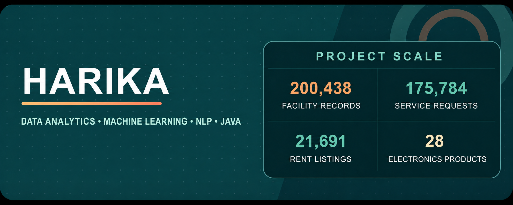
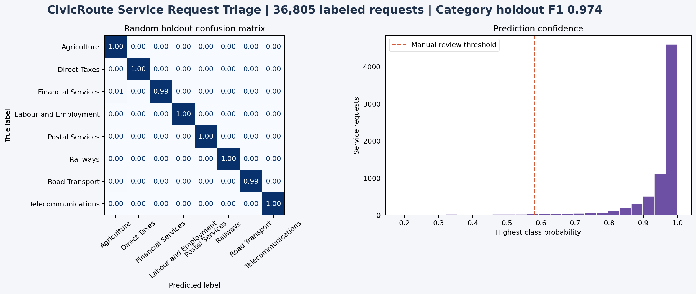

  

  I turn public Indian datasets and everyday service problems into reproducible analysis, evaluated models, and tested software.

  
  

## Project snapshot

| Direction | Project | Evidence |
| :--- | :--- | ---: |
| Data analysis | CareMap Facility Analytics | 200,438 source records and a Power BI ready model |
| Machine learning | MetroRent Price Estimator | 21,691 source listings across five cities |
| Language systems | CivicRoute Service Request Triage | 175,784 source requests and eight service queues |
| Software | BigTech Electronics Store | 28 products, seven categories, and fourteen automated tests |

## Selected projects

### 01 · CareMap Facility Analytics

  

| | |
| :--- | :--- |
| **Problem** | Duplicate facilities, invalid coordinates and inconsistent labels can distort comparisons in a nationwide facility directory. |
| **Approach** | I built a Python acquisition and quality pipeline, a validated analysis table, governed DAX measures and a four page Power BI implementation guide. |
| **Evidence** | 200,438 source records became 193,783 clean records after 6,655 duplicates were removed. The final table has 99.7% mapped records across 36 state and union territory labels. |
| **Stack** | Python · pandas · data quality testing · Power BI · DAX · pytest |

<a href="https://github.com/harikareddy9878-rgb/caremap-facility-analytics"><strong>Repository</strong></a> · <a href="https://github.com/harikareddy9878-rgb/caremap-facility-analytics/blob/main/reports/CareMap_Report.pdf"><strong>PDF report</strong></a>

 

### 02 · MetroRent Price Estimator

  

| | |
| :--- | :--- |
| **Problem** | Rental listings vary widely across cities, while a single estimate can hide uncertainty and local price differences. |
| **Approach** | I combined two public sources, cleaned the listings, used leakage controlled train, calibration and test splits, compared a city median baseline, and calibrated a prediction interval. |
| **Evidence** | 21,691 source listings produced 12,201 model rows across five cities. On 1,831 unseen listings, MAE was ₹11,652 versus a ₹22,122 baseline, with 89.7% interval coverage. |
| **Stack** | Python · pandas · scikit learn · regression · interval calibration · pytest |

<a href="https://github.com/harikareddy9878-rgb/metrorent-price-estimator"><strong>Repository</strong></a> · <a href="https://github.com/harikareddy9878-rgb/metrorent-price-estimator/blob/main/reports/MetroRent_Report.pdf"><strong>PDF report</strong></a>

 

### 03 · CivicRoute Service Request Triage

  

| | |
| :--- | :--- |
| **Problem** | Citizen requests can be delayed when they reach the wrong service queue, while automated routing should keep uncertain cases visible. |
| **Approach** | I built an interpretable TF IDF and logistic regression pipeline with deduplication, random and category group holdouts, confidence based routing and manual review. |
| **Evidence** | 175,784 source requests produced 36,805 prepared examples across eight queues. The unseen category holdout reached 0.974 macro F1 and retained 15.2% of requests for review. |
| **Stack** | Python · pandas · scikit learn · TF IDF · logistic regression · pytest |

<a href="https://github.com/harikareddy9878-rgb/civicroute-service-request-triage"><strong>Repository</strong></a> · <a href="https://github.com/harikareddy9878-rgb/civicroute-service-request-triage/blob/main/reports/CivicRoute_Report.pdf"><strong>PDF report</strong></a>

 

### 04 · BigTech Electronics Store

  

| | |
| :--- | :--- |
| **Problem** | Search, stock, payment, delivery, order history and support require one consistent state model across the shopping journey. |
| **Approach** | I connected a responsive storefront to a Java 17 Spring Boot order API. The backend validates requests, coordinates five bounded components, reserves or releases inventory, and stops later work after failure. |
| **Evidence** | The application covers 28 products, seven categories, eight delivery stages and three controlled checkout outcomes. Ten JavaScript tests and four JUnit tests verify browser and backend behaviour. |
| **Stack** | Java 17 · Spring Boot · JavaScript · HTML · CSS · REST · JUnit · Vercel |

<a href="https://bigtech-store.vercel.app/"><strong>Live application</strong></a> · <a href="https://github.com/harikareddy9878-rgb/bigtech-electronics-store"><strong>Repository</strong></a> · <a href="https://github.com/harikareddy9878-rgb/bigtech-electronics-store/blob/main/reports/BigTech_Report.pdf"><strong>PDF report</strong></a>

## Tools I use

  

  
  
  
  
  
  

<table>
  <tr>
    <td><strong>Analyse</strong> Python · pandas · Power BI · data quality</td>
    <td><strong>Model</strong> scikit learn · regression · NLP · evaluation</td>
    <td><strong>Build</strong> Java · Spring Boot · JavaScript · REST</td>
    <td><strong>Verify</strong> pytest · JUnit · baselines · limitations</td>
  </tr>
</table>

## Project standard

I preserve source provenance, keep generated large files outside Git, separate preparation from evaluation, compare models with a baseline, test the important rules, include limitations beside results, and publish visual evidence with a detailed PDF report.

## Contact

  
  

